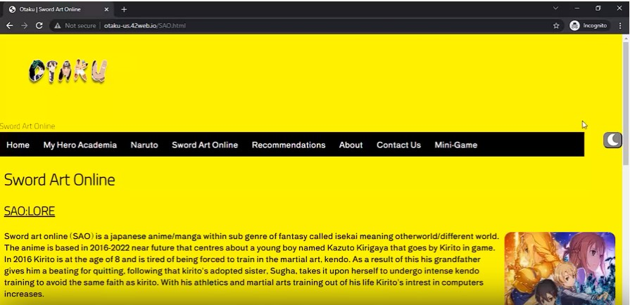
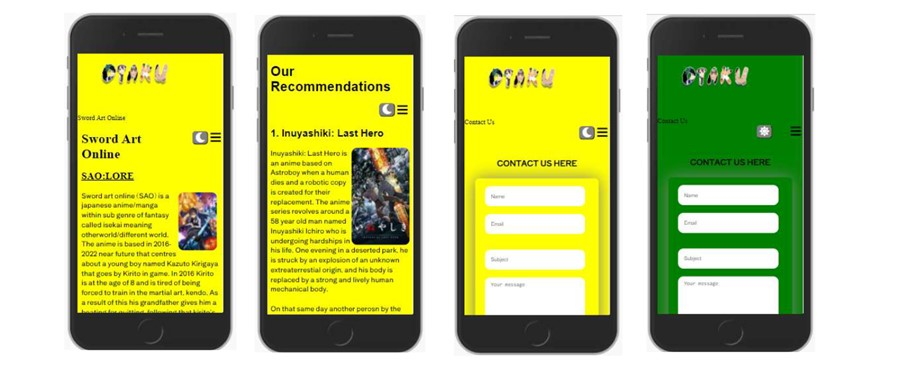

Otaku is a modern anime community that is inspired by the watchers of anime, for everyone to come together as one. It was made during my Web design and development course project as a team of 3 people.

Tech used: 
HTML/CSS/JavaScript
	Here are some of my responsibilities during this project:
• created Hamburger Menu -DOM
• created Yellow to green background colour toggle switch, made with JavaScript - DOM
• Media queries for SAO.html and Contact.html
• created SAO.html, Contact.html, TopPicks.html
• DOM JavaScript for SAO, Contact, About Us and Naruto page.
• JavaScript for About.html -onclick
• CSS for SAO.html and Contact.html
• Form Validation for Contact.html
• Created the mood board and arranged it
• Deployed 
• Created Logo
• Pseudocode
Note: Since this was the first website I have properly made the code or the styling isn’t exactly up to scratch.

Desktop view: 

Mobile View: 

